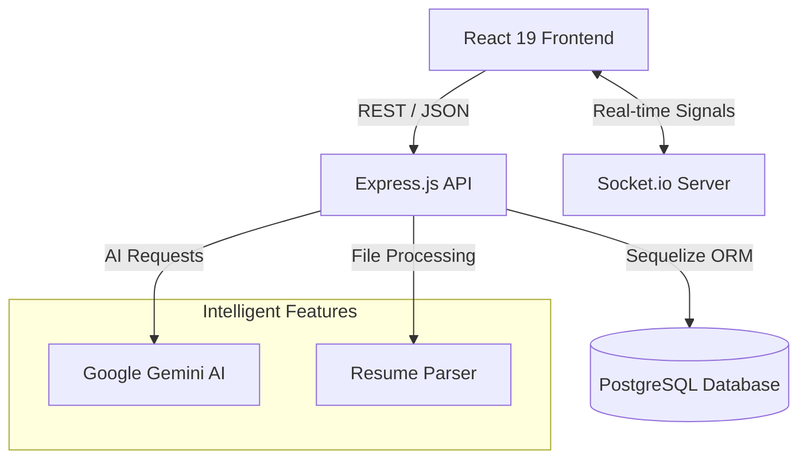

<div align="center">

# 🚀 AI STUDENT GUIDE HUB
### *The Ultimate Career Architect for B.Tech Students*

[](https://opensource.org/licenses/MIT)
[](https://nodejs.org/)
[](https://reactjs.org/)
[](https://www.postgresql.org/)
[](https://ai.google.dev/)

**Empowering the next generation of engineers with AI-driven insights, personalized roadmaps, and real-time career intelligence.**

[Explore Features](#-key-pillars) • [Getting Started](#-installation) • [Architecture](#-system-architecture) • [Contributing](#-contributing)

</div>

---

## 🌟 Key Pillars

### 🎯 AI-Powered Career Guidance
*   **Personalized Roadmaps**: Dynamically generated study paths tailored to your academic year, tech track, and overarching career goals.
*   **AI Mentor**: A sophisticated 24/7 academic advisor capable of explaining complex technical concepts, providing career advice, and prepping you for interviews.
*   **Resume Intelligence**: High-fidelity analysis of your resume with weighted scoring and actionable feedback aligned with FAANG standards.

### 📊 Interactive Learning Engine
*   **Adaptive Quizzes**: Test your expertise with domain-specific evaluations in DSA, Web Dev, DBMS, and more.
*   **Global Leaderboard**: Gamified progression system to track your standing and compete with a community of high-achievers.
*   **Skill-Gap Analysis**: Data-driven identification of areas requiring focus to ensure you're industry-ready.

### 💼 Career Intelligence Hub
*   **Market Signals**: Real-time Socket.io updates on trending technologies and shifting industry demands.
*   **Opportunity Stream**: Curated internships and job listings matching your specific skill profile and career trajectory.

---

## 🛠️ Technology Stack

| Layer | Technologies |
| :--- | :--- |
| **Frontend** | React 19, Vite, Framer Motion, Lucide Icons, Axios |
| **Backend** | Node.js, Express, Socket.io, JWT, Multer |
| **Data** | PostgreSQL, Sequelize ORM |
| **AI/ML** | Google Gemini API, PDF-Parse for Resume Extraction |
| **DevOps** | Render (Backend), Vercel (Frontend), GitHub Actions |

---

## 🏗️ System Architecture



---

## 📦 Installation

### Prerequisites
- **Node.js**: v18.0 or higher
- **PostgreSQL**: A running instance (local or managed like Render)
- **Gemini AI API Key**: Obtainable from [Google AI Studio](https://aistudio.google.com/)

### Step-by-Step Setup

1. **Clone & Explore**
   ```bash
   git clone https://github.com/Shivakumar-09/AI-STUDENT-GUIDE-HUB.git
   cd AI-STUDENT-GUIDE-HUB
   ```

2. **Backend Configuration**
   ```bash
   cd server
   npm install
   ```
   Create a `.env` file in the `/server` directory:
   ```env
   PORT=5000
   DATABASE_URL=your_external_postgresql_url
   GEMINI_API_KEY=your_gemini_api_key
   JWT_SECRET=your_secure_secret_key
   NODE_ENV=development
   ```
   > [!IMPORTANT]
   > Use your **External Database URL** from Render if connecting from your local development environment.

3. **Frontend Initializations**
   ```bash
   cd ../client
   npm install
   npm run dev
   ```

---

## 🎨 Design Philosophy
The AI Student Guide Hub utilizes a **Modern Glassmorphism** aesthetic, emphasizing clarity, transparency, and a futuristic workspace for students. Subtle micro-animations powered by **Framer Motion** provide tactile feedback and a premium user experience across all devices.

---

## 🤝 Contributing
Advancing career guidance for students is a collective effort. We welcome:
- Feature Requests & Bug Reports
- Technical Refinements
- Documentation Improvements

Please refer to the [Contributing Guidelines](CONTRIBUTING.md) for more info.

---

## 📄 License
This project is licensed under the **MIT License** - see the [LICENSE](LICENSE) file for details.

---

<div align="center">
Built with ❤️ for the student community.
</div>
