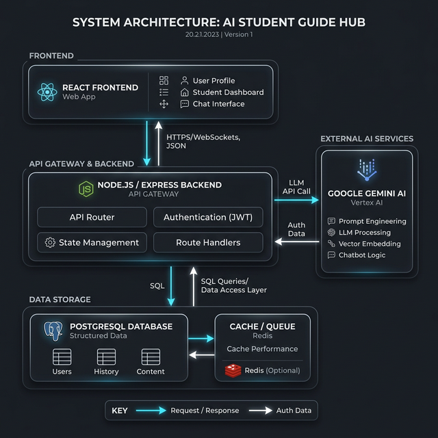

<div align="center">

# 🎓 AI Student Guide Hub

**A full-stack, AI-powered career accelerator platform built for B.Tech students.**
Get personalized mentorship, dynamic roadmaps, mock interviews, and real-time market intelligence — all in one place.

<br/>


<br/>

[🚀 Features](#-features) &nbsp;•&nbsp;
[🏗️ Architecture](#️-system-architecture) &nbsp;•&nbsp;
[🛠️ Tech Stack](#️-tech-stack) &nbsp;•&nbsp;
[📂 Project Structure](#-project-structure) &nbsp;•&nbsp;
[💻 Getting Started](#-getting-started) &nbsp;•&nbsp;
[🔑 Environment Variables](#-environment-variables) &nbsp;•&nbsp;
[🤝 Contributing](#-contributing)

</div>

---

## 📌 Overview

**AI Student Guide Hub** is a comprehensive, production-grade platform designed to bridge the gap between academic learning and industry expectations for engineering students. It combines the power of **Google Gemini Pro**, real-time sockets, and a robust REST API to deliver:

- 🎯 **Personalized, AI-curated career paths** tailored to each student's goals
- 🏆 **MAANG-level interview preparation** with live AI feedback
- 📊 **Real-time hiring market signals** so students always know what skills are in demand
- 🔐 **Secure, role-based access** for both students and administrators

---

## ✨ Features

### 🤖 AI Mentor (Gemini Powered)
Interact with a context-aware AI mentor that delivers personalized academic and career guidance. Choose your preferred explanation depth — concise summaries or detailed ELI5 breakdowns — so every student learns at their own pace.

### 🗺️ Intelligent Study Roadmaps
Generate structured, week-by-week learning roadmaps aligned to specific career tracks such as **Software Development**, **Data Science**, and **AI/ML**. Roadmaps dynamically adapt to your target role and timeline.

### 🎙️ AI Mock Interviews
Simulate real-world technical interviews with AI-driven dynamic questioning. Features include:
- **Speech-to-text** input for a natural interview feel
- **Text-to-speech** feedback delivered in real-time
- **Instant AI evaluation** with scores and improvement tips after each session

### 📄 Smart Resume Analyzer
Upload your PDF resume and receive an instant, structured analysis:
- ✅ ATS compatibility score
- ✏️ AI-rewritten professional summaries
- 🔍 Structural feedback and gap identification
- 💼 Suggested job titles and target roles

### 🧠 Dynamic Quiz Generation
Auto-generate multiple-choice quizzes for any tech domain on demand. Questions are calibrated to **MAANG interview difficulty**, helping students consistently challenge their knowledge.

### 📈 Real-Time Market Signals
Stay ahead of the curve with live, socket-driven career intelligence:
- Emerging technology trend tracking (e.g., *"Cloud Native Adoption +28%"*)
- Live hiring trend updates for top tech companies
- Powered by **Socket.IO** for zero-latency data streams

### 💼 Live Internships & Hackathons
Access a curated, up-to-date database of active internship postings and competitive tech hackathons relevant to B.Tech students.

### 🏅 Leaderboard System
Gamified learning with a real-time leaderboard. Earn points through quizzes, mock interviews, and platform activities, then rank against peers.

### 🔐 Secure Authentication & RBAC
- **JWT-based authentication** for stateless, scalable security
- **Role-Based Access Control (RBAC)** with separate Student and Admin portals
- **Data encryption at rest** for all sensitive user information

---

## 🏗️ System Architecture

> **How to display the diagram:** Upload `architecture.png` to your repository root alongside this README. GitHub will render it automatically.



### Layer Overview

```
┌─────────────────────────────────────────────────────────────────────┐
│                         CLIENT LAYER                                │
│   Student Portal  │  Admin Portal  │  Mock Interview  │  Leaderboard│
│         (React 19 + Vite + Framer Motion + Socket.IO Client)        │
└───────────────────────────┬─────────────────────────────────────────┘
                            │  HTTPS REST + WebSocket
┌───────────────────────────▼─────────────────────────────────────────┐
│                  API GATEWAY  (Express v5 + Node.js)                │
│  /auth  │  /ai/mentor  │  /ai/roadmap  │  /ai/interview             │
│  /resume/analyze  │  /quiz/generate  │  /leaderboard  │  /internships│
└──────────┬──────────────────┬──────────────────────────┬────────────┘
           │                  │                          │
┌──────────▼──────┐  ┌────────▼────────┐      ┌─────────▼──────────┐
│  AI SERVICES    │  │  DATA LAYER     │      │  CROSS-CUTTING      │
│  Google Gemini  │  │  PostgreSQL     │      │  JWT Auth           │
│  ─ Text gen     │  │  Sequelize ORM  │      │  Encryption at rest │
│  ─ Roadmaps     │  │  ─ Users        │      │  Socket.IO          │
│  ─ Interview    │  │  ─ Admins       │      │  multer + pdf-parse │
│  ─ Resume score │  │  ─ Leaderboard  │      │  CORS + RBAC        │
│  ─ MCQ quizzes  │  │  ─ Internships  │      │  Error Handling     │
└─────────────────┘  └─────────────────┘      └────────────────────┘
```

### Request Data Flow

```
Browser
  │
  ├── REST Request ──► Express Router ──► JWT Middleware
  │                                            │
  │                                            ▼
  │                                    Route Handler
  │                                    ├── Gemini API call  ──► AI Response
  │                                    ├── Sequelize query  ──► PostgreSQL
  │                                    └── File parse       ──► pdf-parse
  │
  └── WebSocket ──► Socket.IO Server ──► Real-time broadcast ──► All clients
```

---

## 🛠️ Tech Stack

### Frontend

| Technology | Purpose |
|---|---|
| [React 19](https://react.dev/) + [Vite](https://vitejs.dev/) | UI framework and fast HMR build tooling |
| React Router DOM v7 | Client-side routing and navigation |
| [Framer Motion](https://www.framer.com/motion/) | Fluid UI micro-interactions and animations |
| [Socket.IO Client](https://socket.io/) | Real-time bidirectional communication |
| Axios | Promise-based HTTP client for API requests |
| Lucide React | Consistent, modern icon library |

### Backend

| Technology | Purpose |
|---|---|
| [Node.js](https://nodejs.org/) v16+ + Express v5 | Server runtime and REST API framework |
| [Sequelize](https://sequelize.org/) + `pg` | ORM for PostgreSQL — models, migrations, queries |
| `@google/generative-ai` | Gemini Pro integration for all AI-powered features |
| `jsonwebtoken` + `bcryptjs` | Secure JWT authentication and password hashing |
| `multer` + `pdf-parse` | File upload handling and PDF resume text extraction |
| [Socket.IO](https://socket.io/) Server | Real-time server-side event broadcasting |

### Database & Infrastructure

| Technology | Purpose |
|---|---|
| [PostgreSQL](https://www.postgresql.org/) | Primary relational database |
| Sequelize Sync | Auto-syncing schema on server startup |

---

## 📂 Project Structure

```
AI-STUDENT-GUIDE-HUB/
│
├── client/                        # ⚛️  React Frontend Application
│   ├── public/                    # Static assets (favicon, manifest, etc.)
│   ├── src/
│   │   ├── components/            # Reusable UI components and full page views
│   │   │   ├── AIMentor/          # AI Mentor chat interface
│   │   │   ├── MockInterview/     # Interview simulation components
│   │   │   ├── ResumeAnalyzer/    # Resume upload & results display
│   │   │   ├── Roadmap/           # Study roadmap generation & display
│   │   │   ├── Quiz/              # Dynamic quiz generation & player
│   │   │   ├── Leaderboard/       # Rankings and points display
│   │   │   ├── Internships/       # Internship listings
│   │   │   └── Admin/             # Admin portal views
│   │   ├── config/                # API base URL, environment routing
│   │   ├── main.jsx               # Application entry point
│   │   └── index.css              # Core global styling system
│   ├── package.json
│   └── vite.config.js             # Vite bundler configuration
│
└── server/                        # 🟢  Node.js / Express Backend
    ├── config/
    │   └── database.js            # Sequelize + PostgreSQL connection setup
    ├── models/
    │   ├── User.js                # Student user model (RBAC, encryption)
    │   ├── Admin.js               # Admin user model
    │   └── Leaderboard.js         # Points and ranking model
    ├── utils/
    │   ├── encryption.js          # Data-at-rest encryption helpers
    │   └── gemini.js              # Gemini Pro API integration wrapper
    ├── createAdmin.js             # Admin seeding utility script
    ├── forceUpdateAdmin.js        # Force-update admin account script
    ├── index.js                   # Main server — REST API + Socket.IO
    └── package.json
```

---

## 💻 Getting Started

### Prerequisites

Make sure the following are installed and running on your machine before you begin:

- **Node.js** v16 or higher → [Download](https://nodejs.org/)
- **PostgreSQL** → [Download](https://www.postgresql.org/download/)
- A valid **Google Gemini API Key** → [Get one here](https://ai.google.dev/)

### 1. Clone the Repository

```bash
git clone https://github.com/Shivakumar-09/AI-STUDENT-GUIDE-HUB.git
cd AI-STUDENT-GUIDE-HUB
```

### 2. Setup the Backend

```bash
cd server
npm install
```

Create your `.env` file (see [Environment Variables](#-environment-variables) section), then start the server:

```bash
npm start
```

> ✅ Sequelize auto-syncs all database tables on startup.
> 🌐 Server runs at: **`http://localhost:5000`**

### 3. Setup the Frontend

Open a **new terminal**, then run:

```bash
cd client
npm install
npm run dev
```

> 🌐 Client runs at: **`http://localhost:5173`** — open this in your browser.

---

## 🔑 Environment Variables

Create a `.env` file inside the `server/` directory with the following content:

```env
# ── Server ──────────────────────────────────────────
PORT=5000
NODE_ENV=development
FRONTEND_URL=http://localhost:5173

# ── PostgreSQL Database ──────────────────────────────
DB_NAME=your_database_name
DB_USER=postgres
DB_PASSWORD=your_postgres_password
DB_HOST=localhost
DB_PORT=5432

# ── Security & Authentication ────────────────────────
JWT_SECRET=your_super_secret_jwt_key
ENCRYPTION_KEY=your_32_byte_hex_encryption_key

# ── External APIs ────────────────────────────────────
GEMINI_API_KEY=your_gemini_api_key
```

> ⚠️ **Never commit your `.env` file.** Add `server/.env` to your `.gitignore` immediately.

---

## 👨‍💻 Admin Scripts

Provision and manage admin accounts from the `server/` directory:

```bash
# Create a new admin user
node createAdmin.js

# Force-update an existing admin account (e.g., reset password)
node forceUpdateAdmin.js
```

---

## 🔌 API Reference

| Method | Endpoint | Auth | Description |
|--------|----------|:----:|-------------|
| `POST` | `/api/auth/register` | ❌ | Register a new student account |
| `POST` | `/api/auth/login` | ❌ | Authenticate and receive a JWT |
| `POST` | `/api/ai/mentor` | ✅ | Query the AI Mentor (Gemini) |
| `POST` | `/api/ai/roadmap` | ✅ | Generate a personalized study roadmap |
| `POST` | `/api/ai/interview` | ✅ | Start or continue a mock interview session |
| `POST` | `/api/resume/analyze` | ✅ | Upload and analyze a PDF resume |
| `POST` | `/api/quiz/generate` | ✅ | Generate a topic-specific MCQ quiz |
| `GET`  | `/api/leaderboard` | ✅ | Fetch the current leaderboard rankings |
| `GET`  | `/api/internships` | ✅ | List active internship opportunities |

> 🔒 Routes marked ✅ require the `Authorization: Bearer <token>` header.

---

## 🤝 Contributing

Contributions, bug reports, and feature requests are always welcome!

1. **Fork** the repository
2. Create a new branch: `git checkout -b feature/your-feature-name`
3. Commit your changes: `git commit -m 'feat: add your feature'`
4. Push to your branch: `git push origin feature/your-feature-name`
5. Open a **Pull Request** and describe your changes clearly

Check the [Issues page](https://github.com/Shivakumar-09/AI-STUDENT-GUIDE-HUB/issues) for open tasks or to report a bug.

---

## 📄 License

This project is licensed under the **MIT License** — see the [LICENSE](LICENSE) file for details.

---

<div align="center">

**Built with ❤️ to empower the next generation of tech talent.**

⭐ Star this repo if you found it useful &nbsp;•&nbsp;
🐛 [Report a Bug](https://github.com/Shivakumar-09/AI-STUDENT-GUIDE-HUB/issues) &nbsp;•&nbsp;
💡 [Request a Feature](https://github.com/Shivakumar-09/AI-STUDENT-GUIDE-HUB/issues)

</div>
